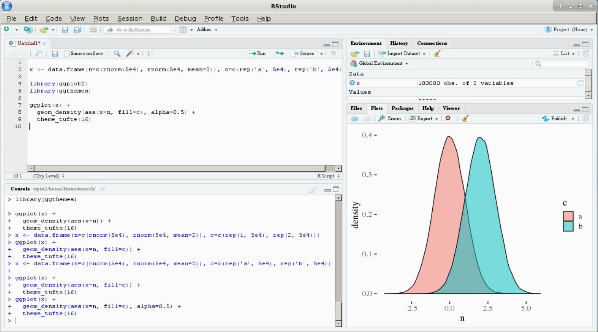
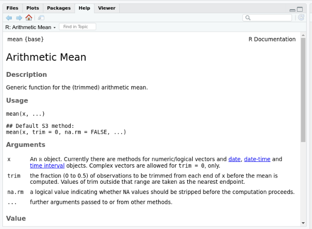

```{r setup, include=FALSE}
options(htmltools.dir.version = FALSE)
knitr::opts_chunk$set(message=FALSE, warning = FALSE, error=TRUE)

``` 


# Plans for Today


1. Workflow: R and Rstudio.

2. How to Interact with R.

3. Packages and Asking for Help in R.

4. Objects e Classes.

5. Data Structure.

6. Importing and Exporting Data in R.

7. Functions.

8. Loops.

--

### `Next week: Dplyr and Tidyverse`

--

---

# What's R?

R is a versatile, open source programming/scripting language that's useful both for statistics but also data science.

- Open source software under **GPL**.

- Superior (if not just comparable) to commercial alternatives. 

- Not just for statistics, but also **general purpose** programming.

- Is **object oriented** (= R has objects) and **functional** (= You can write functions).

- Large and growing community of peers. 


---

## RStudio.

RStudio is the premier R graphical user interface (GUI) and integrated development environment (IDE) that makes R easier to use.

```{r  echo=FALSE, out.width = "100%"}
knitr::include_graphics("figs/R_vs_RStudio_1.png") 
```

.footnote[Source: [Rochele Terman's Intro to CSS Book](https://plsc-31101.github.io/course/r-basics.html)]


---
## Understanding the R Studio

```{r  echo=FALSE, out.width = "100%"}
 
```


---
##  How to Interact with R ?

`Open RStudio!`
--

### Command Line (bottom left panel).

You can interact with R directly using the Command Line. The symbol `>` indicates that R is ready to work! Copy and paste the command below to your command line, and click enter.

```{r}
2+2
```

--

When you see the symbol `+` it means your code was not completed. Then, you shoudl press esc to move back to `>`. 

```{r eval=FALSE}
# Incomplete Code

incomplete<- "I am going to give you an incomplete
```

---

## Using Scripts.

Open a new script: `File` -> `New File` -> `R Script`

The script is just a plain text file. But you can send command from the script to your command line directly.

--
#### `command + enter` (Mac) ou `Ctrl + enter` (PC).  
--

```{r eval=FALSE}
# Rode estas operação em um script. 
# Hashtags permite você comentar seu código. 
2^2
2*2
2/2
```

---

### Why Should I go with scripts?

- More appropriate when working with long codes. 

- Show others all your steps. 

- Allow your future self to return to your code. 


---

## Other Important Tips.

#### Comments.

Use # signs to add comments within your code chunks. Help yourself in the future and make as much comments as you can in your code!

```{r}
# Hello all!
```


#### Errors

When the text is a legitimate error, it will be prefaced with “Error:”, and R will try to explain what went wrong.
```{r}
plot("hello")
```
---

## R Packages. 

--
.pull-left[

#### What the Packages are?
- A set of thematic function someone put together for you. 


- Sometimes packages also bring data


- In the end, just a folder you donwloaded to your computer. 

]

--

.pull-right[

There are a number of `packages` that are supplied with the R distribution. These are known as ``[base packages](https://stat.ethz.ch/R-manual/R-devel/library/base/html/00Index.html)". 

Other we need to install. 

- Packages should be installed only once. 

      `install.packages()`

- Should be loaded every R session. 

  `library()`


]

--

---
class: center, middle

### Installing Packages Via Cran.

```{r eval=FALSE}
install.packages("devtools", force=TRUE)
```


### Load a Package.

```{r eval=FALSE}
library(devtools)
```


### Install Packages Via Github

```{r eval=FALSE}
devtools::install_github("electorArg/polAr")
```


---

## Asking for Help in  R

```{r eval=FALSE}
# Specific to a function
?mean  # Help para a função mean.
help(mean)

# More General
??mean

```

.center[
```{r  echo=FALSE, out.width = "70%"}
 
```
]

---

## Asking for Help on Google.

- **Google**: name of the function + the error message you are getting. 

- Remove all the information about you and your local path

- Try to understand the solution. Copy and Paste will rarely solve your problems. 


---
class: center, middle, inverse

# Objects in R

---

# Objects: Definition?

In simple terms, an `object` is a bit of text that represents a specific value. 

Objects names can only contain letters, numbers, the underscore character, and (unlike Python) the period character.

Assigning values to new objects is how you create things in R. 

<br><br>

### `Everything that exists in R is an object.`


<br><br>


---

## Creating Objects

*(assignment operator)* `<-`

```{r}
# Numeric Objects
x <- 5
y <- 7

# Character Objects
nome <- "Tiago Ventura"

```

---

## Can I use `=` to create objects?

--

Yes. But...

--
.center[

]
--

### What is the value of x?


```{r eval=FALSE}
x<-6 
mean(x=c(5, 7))
```

---
class: center, middle 

## Other important commands

#### Checking my environment.

```{r}
ls()
```

#### Remove Objects

```{r}
rm(y)
```

#### Visualizing Objects

```{r}
print(nome)
```

#### Changing Objects

```{r}
nome <- "Tiago Augusto Ventura"
```

---

## Objects Classes

Every object in R has a **class**. The class describes what the object is. Main classes are:

```{r echo=FALSE}
library(kableExtra)
library(tidyverse)
tibble::tribble(~ Example, ~ Tipo, 
                c("a", "swc"), "Character", 
                c(2, 3, 15), "Numeric", 
                c(1L, 2L), "Interger", 
                c(FALSE, TRUE), "Logical") %>%
  kbl() %>%
  kable_styling(bootstrap_options = c("striped", "hover", "condensed"))


```

---

## Checking the Class of my Objects. 

`class()`

```{r}
class(3)

class(TRUE)

meu_numero_da_sorte= "13"

class(meu_numero_da_sorte)

class(meu_numero_da_sorte==13)

```

---

## Another Way to Go: is.class?

```{r}
is.numeric(2)
is.logical(TRUE)
is.character("2")
is.integer(1L)
```

---

## Coercing Objects.

R allows you to easily change the class of your objects using the functions: `as.class()`

```{r}
# Cria Objeto
num_1_5 <- c(1, 2, 3, 4, 5)

# Altera a classe
char_1_5 <- as.character(num_1_5)

# Checando
class(char_1_5)
class(num_1_5)

# Ou
as.numeric("25")

```


---

class: middle, center, inverse

# Data Structure

---

##  Vector

```{r}

# Numeric Vector
X <- c(1, 2.3, 4, 5, 6.78, 6:10)
X

# Class
class(X)

# Length
length(X)


```

---

## Matrix

**Main Feature:** Rectangular and Numeric.

```{r}

# Coerce to a matrix
x_matrix <- as.matrix(X)

# Build a Matrix.
m <- matrix(1:10, nrow=5, ncol=2)
m
# Acessing a values
m[1, 1] # [rows, columns]

```


---

## List

**Main Feature**: Flexible, huge drawer where you can put anything you want. 

```{r}

# coerce to a list

x_list<- as.list(X)

# or

lista_1 <- list(X, as.matrix(X), as.character(X))

# Visualize a lista.

str(lista_1)

# Acessing a value: double [[]]
lista_1[[1]]

```

---

# Data Frame. 

1. Classic Database. 

2. Rectangular. 

3. Works with columns with different classes.

4. Like a excel spreadsheet .

---


## Creating a Data Frame. 

```{r}

# Coercing
as.data.frame(X)

# Criando Manualmente

data <- data.frame(name=c("Tiago", "Tiago"), 
                   last_name=c("Ventura", "Ventura") ,
                   school=c("UMD", "FGV"), age=c(30,32))
data
```


---

## Pre-Built Data Frames

```{r}
mtcars # already loaded in your R environment

```

---

## Acessing Information from your Data Frame


    `data[rows, columns]`


**Rows**: Only using Numeric Index.


**Columns**: Using both Numeric Index or Textual Keys.

---

**Using Numeric Index**

```{r}
mtcars[,1] # primeira coluna
```

---

**Textual Key**

```{r}
mtcars$mpg

# Ou

bakers[,"mpg"]

```

---

**Row with Numeric Index**

```{r}
bakers[1:5, ]
```


---

### Useful Functions to Understand your Data Frames.


```{r eval=FALSE }

head(mtcars) # First lines

tail(mtcars) # last lines linhas

summary(mtcars) # classes

dim(mtcars) # dimensions

glimpse(mtcars) # summary

```


---

## Exporting Data Frames.

An crucial task you will perform in R relates to  exporting your results, including a new database. T

There are several functions to do this, depending on the format of the output you want. Some examples:

- `write.table()` for txt
- `write.csv()` for csv
- `write.xlsx` for xlsx
- `save()` to export as a RData

---

# Exporting as a  csv.

```{r eval=FALSE}
# make a fake data set

dfake <- data.frame(normal=rnorm(100, 0, 1), 
                    uniform=runif(100, 0, 1), 
                    pois=rpois(100, 10))
# write.function(data, name_to_be_saved)
write.csv(dfake, "dfake.csv")
```

---

### But.. wait.. where is my data? Where R is looking at ?

`R` does not intuitively know where your data is. If the data is in a special folder called "super secret search", we have to tell `R` how to get there.

We do this in two ways:

1. Learn where your files are.


2. Define your **working directory** for this folder: all your outputs and inputs will be there.


---

## Paths

Every time `R` is started, it looks at the same place (called _global path_), unless it is asked to go elsewhere.

```{r}
# Where is my R looking at?
getwd()
```

```{r eval=FALSE}

# Where should R be looking instead?

setwd("/home/venturat/Downloads")
```


---

## Importing data 

```{r}
# Check Dir
getwd()

# See what we have here.
list.files()

# import
dados <- read.csv("dfake.csv")

head(dados)
```

---

## Functions

**Everything that generates an output in R is a function.**

```{r}
x<- c(1, 2, 3, 4, 5)

# Mathematical Functions in R
sum(x, na.rm = TRUE) 
log(x) 
sqrt(x)
mean(x)

```

---

## Inputs, outputs and arguments. 

As we learned in our basic math course, a function maps a input to an output. The logic is the same in R. 

Every function has the following components:

- inputs: most of times an object you send in to the function. 

- outputs: the results of the function. 

- arguments: specify how the function works. 

```{r eval=FALSE}
# Lets see how the mean function works
?mean
```

---

## Creating our own functions. 

.pull-left[

```{r}
some_me <- function( argument1, argument2 ){
  
  value <- argument1 + argument2
  
  return(value) # "return" define the output 
}

some_me(2,3)
some_me(100,123)
some_me(60,3^4)

```

]


.pull-right[

Components:

- **name**: some_me;

- **argument**: argument1 e argument2;

- **body**: everything inside of {}; 

- **return**: output.
]

---

#### Another More General Example 

```{r eval=FALSE}
nome_da_funcao <- function(x,y,z){ ## Argumentos
  ### Corpo: o que a função faz
   	
    out <- what the function does.
  
  ### Conclui Corpo.
    
  	return(out) ## output
}
  ## fecha a função

```


---

## When should you write a function?

<br><br><br>

$$
\texttt{"You should consider writing a function whenever} \\
$$

$$
\texttt{you’ve copied and pasted a block of code more than twice"}
$$

---

# Loops

As one quickly notes, doing any task in R can become redundant. Loops can dramatically increase the efficiency of our workflow when a task is _systematic and repeatable_.  

Let's see a toy example.

```{r}

places_with_ilcss <- c("Buenos Aires",
                       "College Park", 
                       "Mexico City")

# for loop

for(cities in places_with_ilcss){ #iterador
  # repeating
  print(cities)
}

```


---

## What is this doing?

```{r}
cities <- places_with_ilcss[1]
print(cities)
```


```{r}
cities <- places_with_ilcss[2]
print(cities)
```


```{r}
cities <- places_with_ilcss[3]
print(cities)
```

---
## Components of a for loop


**`for(item in group_of_items)`: the sequence**

  - item: index for each repetition.
    
  - group_of_items:  object we are drawing the item from
  

--

**Parenthesis {}**

  - What it is to be repeated goes here. 
  
  
--

**Containers**

  - Created outside of the loop. 
  
  - Object to save all your outputs. 

--

---

## A more realistic example. 

```{r}
##devtools::install_github("apreshill/bakeoff")
library(bakeoff)
data("ratings_seasons")
```

We want to calculate the average number of views per season. 

```{r}
# How many Seasons?
temporadas <- unique(ratings_seasons$series)
temporadas

# Average Views

#Temporadas
temporada_1 <- ratings_seasons[ratings_seasons$series==temporadas[1],]
temporada_2 <- ratings_seasons[ratings_seasons$series==temporadas[2], ]
temporada_3 <- ratings_seasons[ratings_seasons$series==temporadas[3], ]

# Take the mean

mean(temporada_1$viewers_7day)

```

---

## Building our loop: Computationally Thinking. 


1. Think about and specify the length of something you want to loop through. In our case, it's the number of seasons.

2. Set the code up so that every iteration only performs a manipulation on a single subset at a time.

3. Save the contents of each iteration in a new object that won't be overwritten. Here we want to think in terms of "stacking" results or concatenating them. 

In practice... read your code, see what is repeating, and make it general. 

---

```{r}

# Containes
container <- list()

for(i in 1:length(temporadas)){ # Step  1
  
 # step 2  
 temp=ratings_seasons[ratings_seasons$series==temporadas[i], ] 
 
 # Step 3
 container[[i]] <- mean(temp$viewers_7day)  
  
}
container
```

---

## I know!!!

.center[

]

---
class: center, middle, inverse

## Next Week

### Tidyverse: and you will fell better! I promise!


