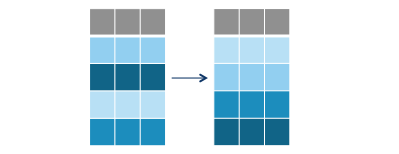
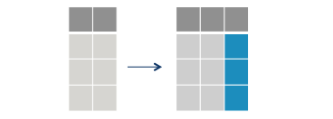

```{r setup, include=FALSE}
options(htmltools.dir.version = FALSE)
knitr::opts_chunk$set(message=FALSE, warning = FALSE, error=FALSE, cache=TRUE)

``` 


# Plans for Today

<br><br> 

1. Introduction to Tidyverse.

2. Data manipulation with dplyr.

3. Working with relational data with dplyr.


---

# Data Manipulation

90% of our work as applied researchers consists of data wrangling and preparation.. this process involves ...


- manipulate variables

- join databases

- change the format of the data

- cleaning...

For all these tasks, we will use the packages from `tidyverse`

---

# Tidyverse

`Tidyverse` is a family of R packages. These packages share the same underlying design, philosophy, grammar and data structures.

The purpose of `tidyverse` is to provide an integrated set of tools for using R as a language in data science. These are the main packages of `tidyverse`:

- `dplyr`: for data manipulation.

- `ggplot2`: for data visualization.

- `tidyr`: to prepare your data for analysis.

- `purrr`: to optimize your code and for functional programming.

- `readr`: to open and organize the data.

- `stringr`: for manipulating text objects.

- `forcats`: for manipulation of the class factors.

---
# Advantages of the Tidyverse ... in a gif

.center[

```{r echo = FALSE, out.width =" 60% "}
knitr::include_graphics("https://media.giphy.com/media/elUGwgiPOdq7e/giphy.gif")
```

]

---

# Advantages of the Tidyverse ... in words.

- `tidyverse` substantially facilitates data analysis tasks when compared to basic R codes.

- It substantially increases how readable your code looks.

- Manipulation, visualization and modeling are integrated in a single philosophy.

- It is widely used in the R community. Therefore, you probably need to learn to read code from other colleagues.


---
class: middle, center

# Introduction to Tidyverse

---
## Installation

```{r eval = FALSE}

install.packages ("tidyverse")

```

```{r}
library(tidyverse)
```


---

## Tibbles.


The fundamental object of `tidyverse` are databases.

`Tidyverse` call databases with a new name: "tibbles". In the tidyverse world, tibbles are a updated version of the `dataframe` base class in R. 

Tibbles are exactly the same as `data.frames` in their basic structure. However, tibbles have some adjustments - most of them visual - to make them easier to use.

---

## Creating Tibbles.

--
.pull-left[
```{r}

# Class of mtcars Database
class (mtcars)

# Convert to tibbles
mtcars_tib <- as_tibble (mtcars)
mtcars_tib
```
]

--

.pull-right[
```{r}
tibble (a = c ("Tiago", "Ventura"),
       b = c ("first name", "last name"))
```

]

--

---

## Pipe.

.pull-left[
```{r echo = FALSE, out.width =" 60% "}
knitr::include_graphics ("figs/pipe.jpg")
```
]

.pull-right[

The use of `%>%` pipes is a fundamental part of how the functions from the `tidyverse` packages work.

The main advantages of the pipe:

- Concatenate the functions of your code.

- Avoid intermediate objects.

- Make your codes more intuitive.

- Avoids multiple parentheses.

]


---

### The base R works from the inside out:

```{r}
# R
x <- c(1:10)
round(exp(sqrt(mean (x))), 1)

```

### The Pipe

```{r}
x%>%
  mean()%>%
  sqrt()%>%
  exp()%>%
  round(1)
```

---

# Important notes about pipes.

**1. Pipes should always be used to connect functions and their outputs.**

```{r eval = FALSE}

# Do not run this code.
x%>%
  function1 (arg1 = x)%>%
  function2 (arg = output_da_funcao1)
```

**Example:**

```{r out.width ="30%"}
sample (1: 1000, 500, replace = TRUE)%>%
  density ()%>% # function 1.
  plot () # function 2.
```

---

**2. The input from a pipe can always be omitted, or represented by the shortcut `.` **

```{r}
sample(1:1000, 500, replace = TRUE)%>%
  density(.)%>% # function 1.
  plot(.) # function 2.
```

---

**3. The results of the pipe are not saved automatically. You need to assign them to a new object.**

```{r}
graph <- sample (1: 1000, 500, replace = TRUE)%>%
              density (.)%>% # function 1.
              plot (.) # function 2.
```


---
class: middle, center, inverse

# Data manipulation with `dplyr`.

---
## Brazilian Electoral Data: 

```{r eval = FALSE}
if(!require ("devtools")) install.packages("devtools")
devtools::install_github("Cepesp-Fgv/cepesp-r")
```

```{r}
library(cepespR)
library(tidyverse)
pres_rio <- get_votes(year = 2018,
                         position = "President",
                         regional_aggregation = "Municipio",
                         state = "RJ")%>%
                  as_tibble()
```

---

## Introduction to Dplyr.

`Dplyr` is one of the most popular packages in R.

The idea behind the `dplyr` functions is  simple: its functions do exactly what their names describe (**verb based language**). These are the most useful functions: 

.pull-left[

- `select()`: to select columns.

- `filter()`: to filter the database by rows

- `mutate()`: to create new variables and change existing ones.

- `arrange()`: to sort the database.

- `group_by()`: to group and perform analyses within the subgroups.

- `summarize()`: to summarize the data -- as a whole or by subgroups.

]

.pull-right[

All of these functions follow the same structure:

- The input is always a database (tibble or dataframe).

- The database is always the first argument.

- The following arguments will access database columns directly, **without quotes.**

- The output is always a new database.

]

---

**Some other less used functions**:

- `count()`:  to count the number of observations by subgroups.

- `distinct()`: to eliminate repetitions.

- `n():` to count how many observations there are in grouped data.

- `sample_n():` to select n samples from your database

- `glimpse():` to provide a summary of your data.

- `top_n():` to select by rows according to the rank of the variables.

- `slice()`: to filter your database by position in the rows.

---

# Select: Select Columns.


```{r echo = FALSE, out.width =" 80% "}
knitr::include_graphics("figs/select.png")
```

---
## Basics 

```{r}

pres_rio %>% # Data
  select(ANO_ELEICAO, SIGLA_UE, COD_MUN_IBGE) #<<
```

---

## Reordering Columns

```{r}
pres_rio %>% # Data
  # select columns
  select(QTDE_VOTOS, ANO_ELEICAO,  SIGLA_UE, #<<
         NOME_MUNICIPIO, COD_MUN_IBGE) # #<<
```

---

## Renaming Columns

```{r}
pres_rio %>%
  # selects columns with new names.
  select(votes = QTDE_VOTOS, #<<
         year = ANO_ELEICAO, #<<
         parents = SIGLA_UE, #<<
         mun = NOME_MUNICIPIO, #<<
         cod = COD_MUN_IBGE) # columns
```

---

## Saving a new dataset.

```{r}
rio_reduced <- pres_rio %>% # Data
                 # selects columns with new names.
                 select(votes = QTDE_VOTOS, #<<
                        year = ANO_ELEICAO, #<<
                        states = SIGLA_UE, #<<
                        mun = NOME_MUNICIPIO, #<<
                        cod = COD_MUN_IBGE)# columns
```

---

## Shortcuts for  Select.

- `contains ()` - Extract columns that contain certain text.

- `starts_with ()` - Extract columns that start with a given text.

- `ends_with ()` - Extract columns that end with a given text.

- `everything ()` - Extract all remaining columns.

---

## Examples

```{r}
pres_rio %>%
  # select columns where NOME appears
  select(contains("NOME")) #<<
```


```{r}
pres_rio %>%
  # select columns ending with UF and
  # all other remaining columns
  select(ends_with("UF"), everything()) #<<
```

---

## Filter: Filters Rows by Logical Conditions.


      filter (data, column == "a")


```{r echo = FALSE, out.width="80%"}
knitr::include_graphics ("figs/filter.png")
```

---

## Filter: Basics


```{r}
pres_rio %>%
  # filter cases where 17 is equal.
  filter (NUMERO_CANDIDATO == 17)%>% #<<
  # select
  select (DESCRICAO_CARGO, NUMERO_CANDIDATO, QTDE_VOTOS, NOME_MUNICIPIO)
```

---

## Filter: Multiple Conditions

```{r}
pres_rio %>%
  # filter using or
  filter(NUMERO_CANDIDATO == 17 | NUMERO_CANDIDATO == 13, # or #<<
  #filter using and
         NOME_MUNICIPIO == "Rio de Janeiro")%>% # and #<<
  #select
  select(DESCRICAO_CARGO, NUMERO_CANDIDATO, QTDE_VOTOS, NOME_MUNICIPIO)
```

---

## Arrange: Sort rows by columns.

    arrange (date, column)

```{r echo = FALSE, out.width="80%"}

```

---

## Arrange: Basics.
  
```{r}

pres_rio %>%
  # filter by lines
  filter(NUMERO_CANDIDATO == 13)%>%
  # select
  select(DESCRICAO_CARGO, NUMERO_CANDIDATO,
         QTDE_VOTOS, NOME_MUNICIPIO)%>%
  # sort in ascending order
  arrange(QTDE_VOTOS) #<<
```

---

## Arrange: Descending


```{r}
pres_rio %>%
  # filter by lines
  filter(NUMERO_CANDIDATO == 13)%>%
  # select
  select(DESCRICAO_CARGO, NUMERO_CANDIDATO,
         QTDE_VOTOS, NOME_MUNICIPIO)%>%
  # sort in descending order
  arrange(desc(QTDE_VOTOS)) # <<
```

---

## Mutate: Adds a new column.

    mutate (date, new_column_name = new_column_values)

```{r echo = FALSE, out.width =" 80% "}

```

---

### Mutate: Basics

```{r}
pres_rio %>%
  # create variable with state and city
  mutate(city_state = paste(NOME_MUNICIPIO, "-", NOME_UF)) %>% #<<
  #selects to view
  select (NOME_MUNICIPIO, NOME_UF, city_state)
```

---

### Mutate: Conditionals

```{r}
pres_rio %>%
  # create variable using conditionals
  mutate(state_sigla = ifelse(NOME_UF == "Rio de Janeiro", "RJ", NA), #<<
  # concatenate new variable with city
         state_city = paste(state_sigla, "-", NOME_MUNICIPIO))  %>% #<<
  #select
  select(NOME_UF, NOME_MUNICIPIO, state_sigla, everything())
```

---

### Mutate: Mathematical Operations.

```{r}
pres_rio %>%
  # log of votes
  mutate(log_votos = log(QTDE_VOTOS)) %>% #<<
  # select
  select(QTDE_VOTOS, log_votos) #<<
```

---


## Group_by + Summarize. 

```{r echo=FALSE, out.width="60%"}
knitr::include_graphics("figs/group_by.png")
```

---

### Group_by

The `group_by` function works splitting -- under the hood -- your database according unique subgroups of a particular variable.  

Let's see an example:

```{r}
pres_rio %>%
  # grouping by the number of the candidates
  group_by(NUMERO_CANDIDATO) 
```


---

## Summarize.

The `summarize` creates a new data frame based on the summaries you asked the function to perform. 

When used together with `group_by`, it allows you to easily gather information for subgroups of your dataset. 


```{r echo=FALSE, out.width="50%"}
knitr::include_graphics("figs/summarize.png")
```

---

## Summarize: Basics.


```{r}
pres_rio %>%
  # first round
  filter(NUM_TURNO==1) %>%
  # group
  group_by(NUMERO_CANDIDATO) %>%
  # Summing the number of votes
  summarise(voto_estado=sum(QTDE_VOTOS)) %>%
  # arranging
  arrange(desc(voto_estado))


```

---

class:center, middle, alert

### The summarize goes from multiple to  way fewer rows. 

---

### More Exaples

**Who won the election in the run-off?**

```{r}
pres_rio %>%
  
  filter(NUM_TURNO==2) %>%

  group_by(NUMERO_CANDIDATO) %>%
  
  summarise(voto_estado=sum(QTDE_VOTOS)) %>%

    arrange(desc(voto_estado))
```
---

**Total Number of Votes per Municipality**

```{r}
pres_rio %>%

  filter(NUM_TURNO==1) %>%
  
  group_by(NOME_MUNICIPIO) %>%

  summarise(voto_mun=sum(QTDE_VOTOS)) 
```

---

**Voters in the Districts**

```{r}
pres_rio %>%

  filter(NUM_TURNO==1) %>%
  
  group_by(NUMERO_CANDIDATO, NOME_MESO) %>%
  
  summarise(voto_media=mean(QTDE_VOTOS), 
            voto_min=min(QTDE_VOTOS), 
            voto_max=max(QTDE_VOTOS))
  
```

---

### Mutate x Summarize. 

.pull-left[
```{r}

pres_rio %>%

  filter(NUM_TURNO==1) %>%
  
  group_by(NUMERO_CANDIDATO) %>%
  
  mutate(voto_estado=sum(QTDE_VOTOS)) %>%
  
  select(NUMERO_CANDIDATO, voto_estado) %>%
  

  ungroup() 


```
]

.pull-right[
```{r}

pres_rio %>%

  filter(NUM_TURNO==1) %>%
  
  group_by(NUMERO_CANDIDATO) %>%
  
  summarize(voto_estado=sum(QTDE_VOTOS)) %>%
  
  slice(1:5) 


```
]

---

## Joins

Connecting our dataset with information from other sources is crucial in any applied project. Mastering this skill  is fundamental for your training!

`dplyr` has a set of functions to merge dataframes. These functions are all inspired by another language called **SQL**.

When connecting two datasets, we called **keys** the name of the variables used in the merging. These variables must always be unique (one per row) and complete (no missing). 


---

Let's create two datasets to practice with some `joins` functions. 

```{r}
data1 <- tibble(nome=c("A", "B", "C"), 
                value=c(10, 20, 30)) 
data2 <- tibble(nome=c("A", "D", "C"), 
                value2=c(10, 50, 30))
data1
data2
```

---


### left_join()

.pull-left[
```{r echo=FALSE,out.width="80%"}
knitr::include_graphics("figs/left-join.gif")
```
]

.pull-right[

```{r}
left_join(data1, data2)
```

]
---

### inner_join()

.pull-left[
```{r echo=FALSE,out.width="80%"}
knitr::include_graphics("figs/inner-join.gif")
```
]

.pull-right[
```{r}
inner_join(data1, data2)

```
]

---

## full_join()

.pull-left[
```{r echo=FALSE,out.width="80%"}
knitr::include_graphics("figs/full-join.gif")
```
]

.pull-right[
```{r}
full_join(data1, data2)

```
]

---

### Distinct Keys?

```{r}
data3 <- data2 %>%
          # alterando o nome
          select(chave=nome, everything())

# Join

left_join(data1, data3, 
          by=c("nome"="chave")) # adicione argumento by.

```

---
class: middle, center, inverse

## What is next?

---

## Some Suggestions:

- Scoped Verbs in Dplyr. See Rebecca Barter [Tutorial](http://www.rebeccabarter.com/blog/2019-01-23_scoped-verbs/)

- [Tidy Data](https://r4ds.had.co.nz/tidy-data.html)

- [stringr](https://r4ds.had.co.nz/strings.html) and [forcats](https://r4ds.had.co.nz/factors.html) to work with characters and factors

- and practice... practice.. practice...


---

class: middle, center, inverse

### See you again for the data visualization class!


